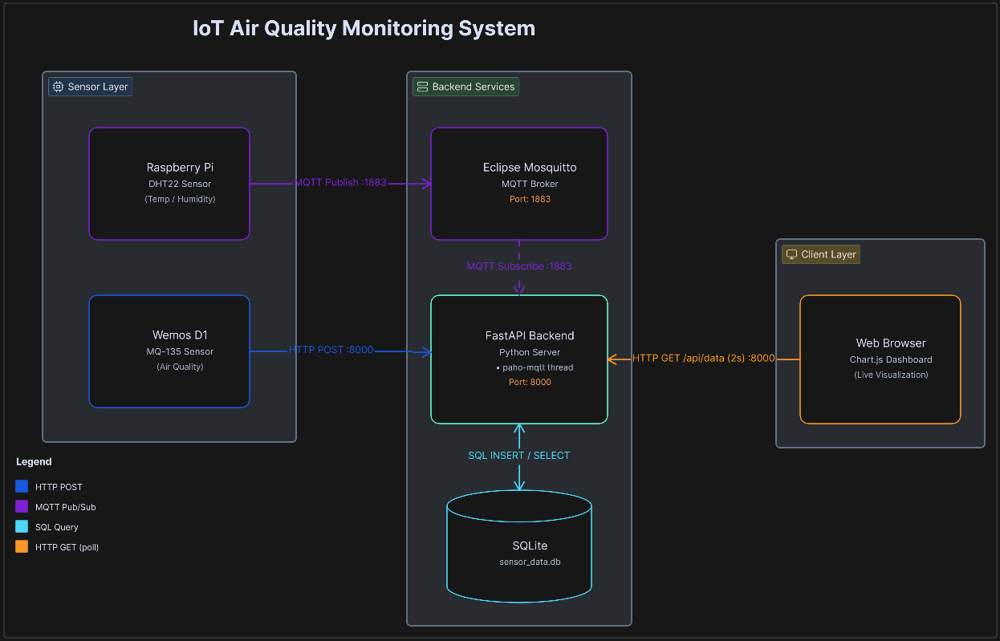
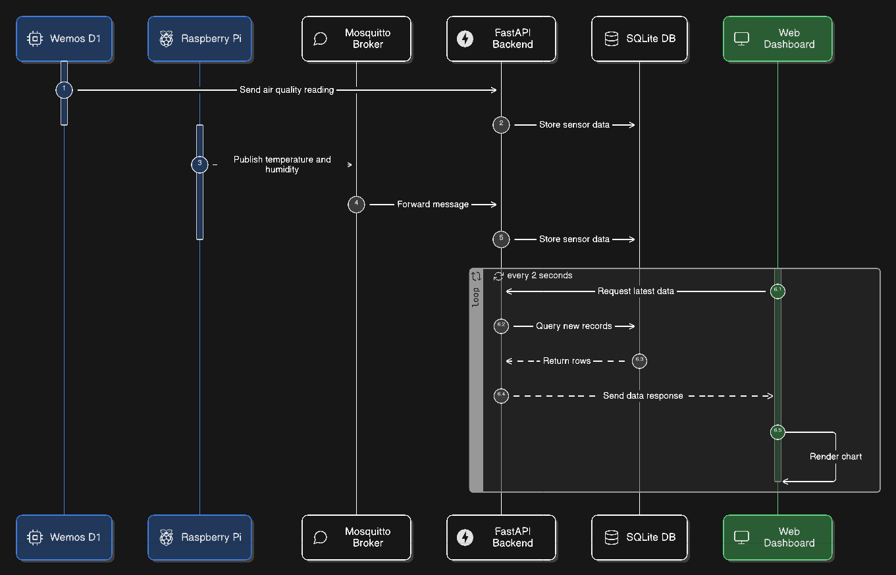
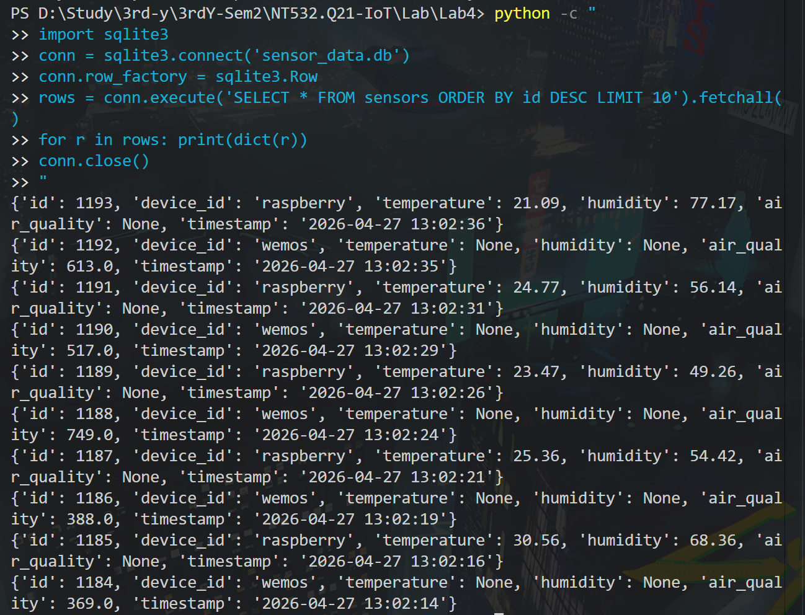
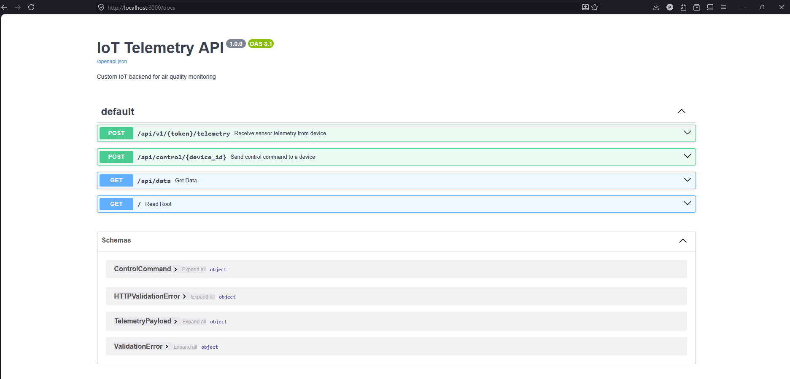
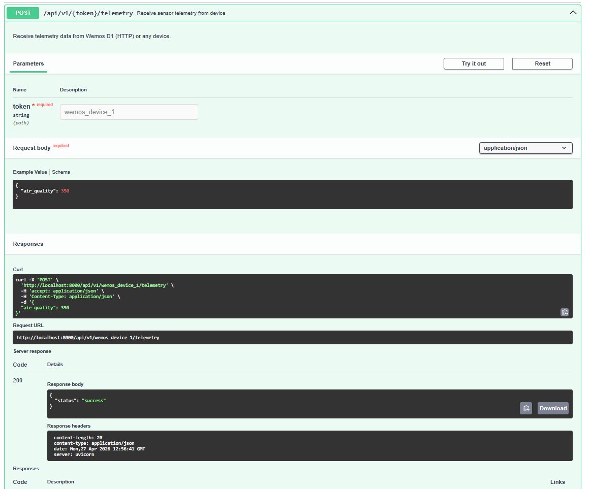
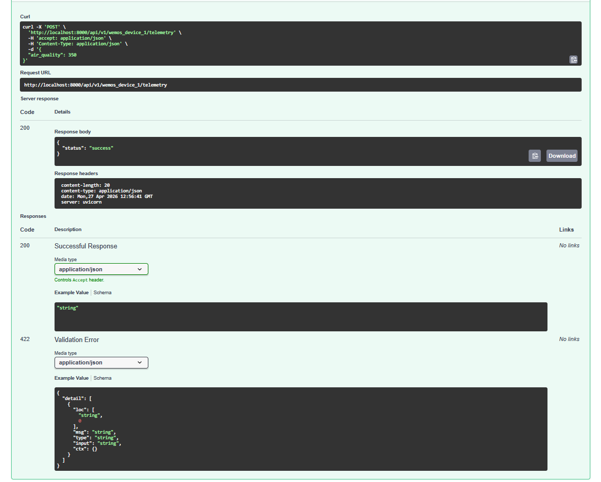
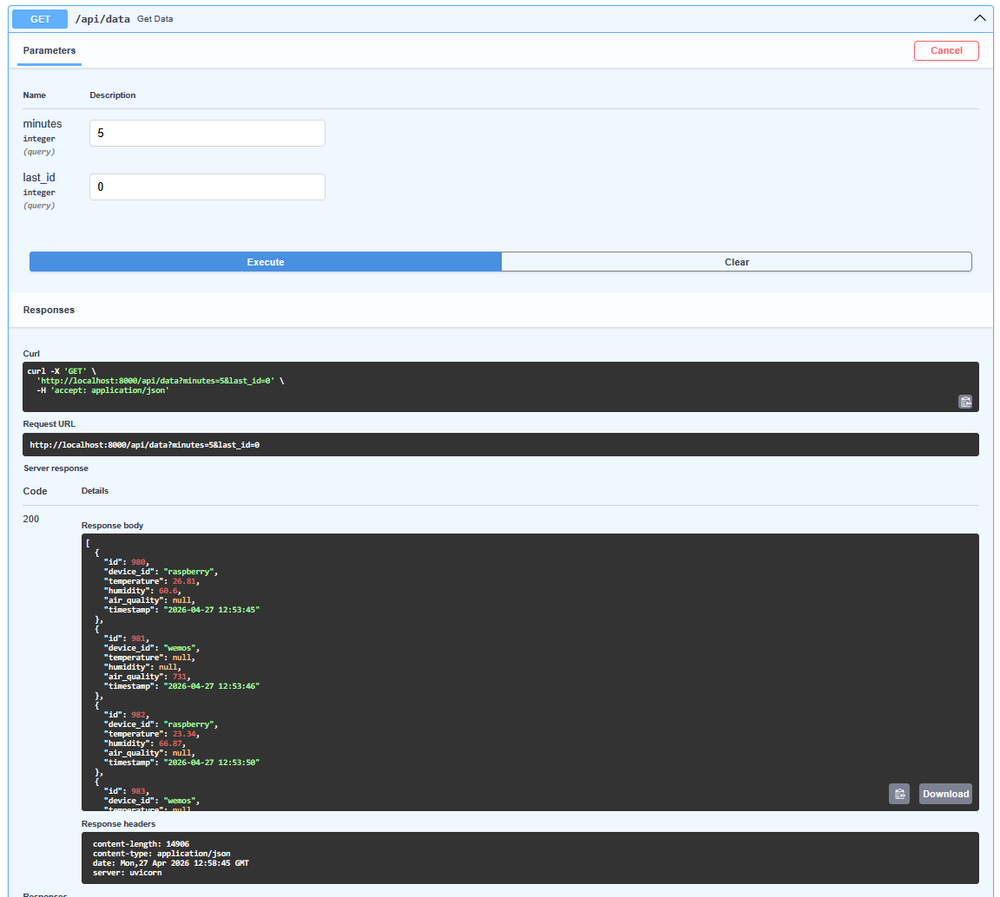
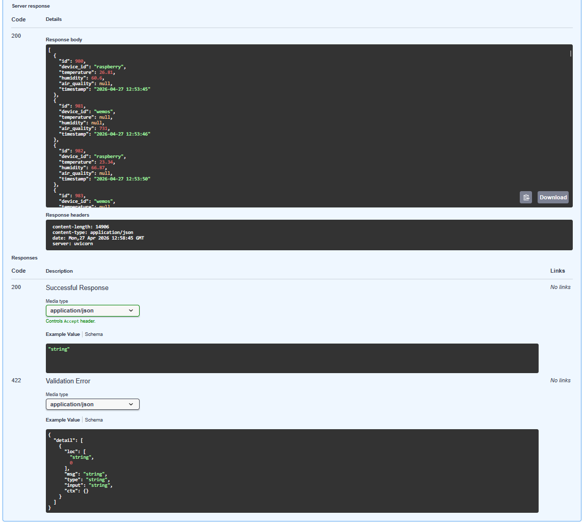
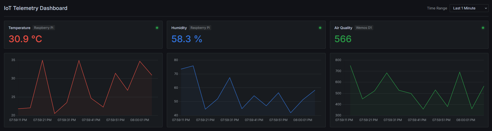
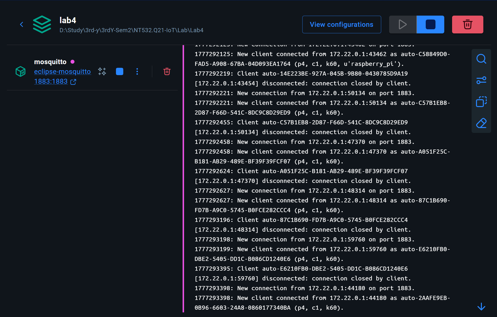

# Lab 04 – Hệ thống IoT Giám sát Chất lượng Không khí (Nâng cao)

> **Thành viên nhóm:** *(điền tên + MSSV)*  
> **GVHD:** Phan Trung Phát  
> **Môn:** NT532.Q21 – Công nghệ Internet of Things Hiện đại

---

## Mục lục

1. [Kiến trúc hệ thống](#1-kiến-trúc-hệ-thống)
2. [Luồng dữ liệu](#2-luồng-dữ-liệu)
3. [Thiết kế cơ sở dữ liệu](#3-thiết-kế-cơ-sở-dữ-liệu)
4. [Mô tả REST API](#4-mô-tả-rest-api)
5. [Giao diện Dashboard & Demo hệ thống](#5-giao-diện-dashboard--demo-hệ-thống)
6. [Hướng dẫn triển khai](#6-hướng-dẫn-triển-khai)

---

## 1. Kiến trúc hệ thống

### Sơ đồ khối



*Hình: Block diagram toàn bộ hệ thống — Sensor Layer (Raspberry Pi + Wemos D1), Backend Services (Mosquitto + FastAPI + SQLite), và Client Layer (Chart.js Dashboard). Màu sắc mũi tên phân biệt theo giao thức: xanh dương = HTTP POST, tím = MQTT Pub/Sub, xanh cyan = SQL, cam = HTTP GET polling.*

### Vai trò từng thành phần

| Thành phần | Vai trò |
|---|---|
| **Wemos D1** | Thu thập chỉ số chất lượng không khí (MQ-135), gửi qua HTTP POST mỗi 5 giây tới Backend |
| **Raspberry Pi** | Thu thập nhiệt độ & độ ẩm (DHT22), publish MQTT tới Mosquitto Broker mỗi 5 giây |
| **Mosquitto Broker** | MQTT message broker trung gian, nhận message từ Raspberry Pi và chuyển tới Backend subscriber |
| **FastAPI Backend** | Nhận dữ liệu từ cả hai thiết bị, validate payload, lưu vào SQLite, cung cấp REST API cho Dashboard |
| **SQLite** | Lưu trữ toàn bộ dữ liệu cảm biến dạng time-series với timestamp |
| **Web Dashboard** | Hiển thị giá trị hiện tại, biểu đồ lịch sử, và trạng thái kết nối thiết bị theo thời gian thực |

### Công nghệ sử dụng

| Thành phần | Công nghệ |
|---|---|
| Backend | Python 3.x, FastAPI, Uvicorn |
| MQTT Client (Backend) | paho-mqtt |
| MQTT Broker | Eclipse Mosquitto (Docker image `eclipse-mosquitto:latest`) |
| Database | SQLite 3 (tích hợp sẵn Python) |
| Frontend | HTML5, CSS3, Vanilla JavaScript, Chart.js |
| Firmware Wemos D1 | Arduino C++, ESP8266WiFi, ESP8266HTTPClient |
| Firmware Raspberry Pi | Python 3, paho-mqtt, Adafruit_DHT |
| Container | Docker, Docker Compose |

### Thông tin triển khai (địa chỉ & cổng)

| Dịch vụ | IP (truy cập từ trình duyệt) | IP (thiết bị vật lý kết nối) | Port |
|---|---|---|---|
| MQTT Broker (Mosquitto) | `localhost` | `10.0.88.218` | `1883` |
| Backend API Server | `localhost` | `10.0.88.218` | `8000` |
| Web Dashboard | `localhost` | `10.0.88.218` | `8000` |

> **Lưu ý:** `localhost` chỉ dùng khi truy cập từ chính máy chủ. Wemos D1 và Raspberry Pi là thiết bị vật lý trên mạng LAN, phải dùng IP `10.0.88.218` (địa chỉ Wi-Fi của máy chủ) để kết nối.

---

## 2. Luồng dữ liệu

### Sơ đồ luồng (Sequence Diagram)



*Hình: Sequence diagram thể hiện toàn bộ hành trình dữ liệu — Wemos D1 gửi HTTP POST, Raspberry Pi publish MQTT, FastAPI Backend lưu SQLite, và Web Dashboard polling mỗi 2 giây để render Chart.js.*


### Mô tả từng bước

1. **Wemos D1 sinh dữ liệu:** Đọc ADC từ cảm biến MQ-135 mỗi 5 giây, đóng gói thành JSON `{"air_quality": <value>}`, gửi HTTP POST tới `http://<server_ip>:8000/api/v1/<token>/telemetry`.
2. **Raspberry Pi sinh dữ liệu:** Đọc DHT22 mỗi 5 giây, đóng gói thành JSON `{"temperature": <value>, "humidity": <value>}`, publish lên MQTT topic `v1/devices/me/telemetry` tới broker `<server_ip>:1883`.
3. **Backend nhận HTTP:** FastAPI parse JSON request, gọi `insert_data("wemos", aq=...)`, lưu vào SQLite.
4. **Backend nhận MQTT:** Background thread (`mqtt_thread`) subscribe topic, callback `on_message` parse payload, gọi `insert_data("raspberry", temp=..., hum=...)`, lưu vào SQLite.
5. **Dashboard polling:** Frontend JavaScript gọi `GET /api/data?minutes=5` mỗi **2 giây** để lấy các bản ghi mới nhất theo khoảng thời gian.
6. **Dashboard render:** Nhận JSON array, cập nhật Chart.js line chart và các giá trị hiện tại. Cơ chế delta-polling: chỉ fetch dữ liệu có `id > lastId` để tránh tải lại toàn bộ.

### Định dạng payload thực tế

**MQTT Payload từ Raspberry Pi:**
```json
{
  "temperature": 27.1,
  "humidity": 77.7
}
```

**HTTP POST Body từ Wemos D1:**
```json
{
  "air_quality": 309
}
```

**JSON Response từ `GET /api/data?minutes=5`:**
```json
[
  {
    "id": 142,
    "device_id": "raspberry",
    "temperature": 27.1,
    "humidity": 77.7,
    "air_quality": null,
    "timestamp": "2026-04-27 12:16:31"
  },
  {
    "id": 143,
    "device_id": "wemos",
    "temperature": null,
    "humidity": null,
    "air_quality": 309,
    "timestamp": "2026-04-27 12:16:35"
  }
]
```

---

## 3. Thiết kế cơ sở dữ liệu

### Schema bảng `sensors`

| Tên cột | Kiểu dữ liệu | Ý nghĩa | Ràng buộc |
|---|---|---|---|
| `id` | `INTEGER` | Khóa chính tự tăng | `PRIMARY KEY AUTOINCREMENT` |
| `device_id` | `TEXT` | Định danh thiết bị (`"raspberry"` hoặc `"wemos"`) | `NOT NULL` |
| `temperature` | `REAL` | Nhiệt độ (°C) từ DHT22 | Nullable (chỉ Raspberry Pi có) |
| `humidity` | `REAL` | Độ ẩm (%) từ DHT22 | Nullable (chỉ Raspberry Pi có) |
| `air_quality` | `REAL` | Chỉ số chất lượng không khí từ MQ-135 | Nullable (chỉ Wemos D1 có) |
| `timestamp` | `DATETIME` | Thời điểm ghi nhận bản ghi | `DEFAULT CURRENT_TIMESTAMP` |

**DDL tạo bảng:**
```sql
CREATE TABLE IF NOT EXISTS sensors (
    id          INTEGER PRIMARY KEY AUTOINCREMENT,
    device_id   TEXT,
    temperature REAL,
    humidity    REAL,
    air_quality REAL,
    timestamp   DATETIME DEFAULT CURRENT_TIMESTAMP
);
```

### Ví dụ bản ghi thực tế

Ảnh dưới đây là kết quả truy vấn trực tiếp từ SQLite trong quá trình kiểm thử hệ thống:



*Hình: Kết quả `SELECT * FROM sensors ORDER BY id DESC LIMIT 10` — dữ liệu được sinh bởi script mô phỏng thiết bị trong quá trình phát triển và kiểm thử hệ thống.*

### Lý do lựa chọn SQLite

SQLite được chọn vì phù hợp với đặc thù dữ liệu IoT dạng time-series trong phạm vi lab:
- **Ghi tuần tự, liên tục:** Mỗi chu kỳ 5 giây có 1–2 bản ghi INSERT, SQLite xử lý tốt với workload này.
- **Đọc theo khoảng thời gian:** Câu truy vấn `WHERE timestamp >= datetime('now', '-5 minutes')` được hỗ trợ native.
- **Không cần cài đặt thêm:** SQLite tích hợp sẵn vào Python, giảm độ phức tạp triển khai.
- **Giới hạn:** Không phù hợp hệ thống production có nhiều thiết bị đồng thời hoặc cần horizontal scaling. Trong trường hợp đó nên dùng InfluxDB hoặc TimescaleDB.

---

## 4. Mô tả REST API

### Bảng endpoint đầy đủ

| Method | URL | Chức năng | Tham số đầu vào | Ví dụ Response |
|---|---|---|---|---|
| `GET` | `/` | Trả về giao diện Dashboard | Không có | HTML page |
| `POST` | `/api/v1/{token}/telemetry` | Nhận dữ liệu HTTP từ Wemos D1 | Body JSON: `{"air_quality": 309}` | `{"status": "success"}` |
| `GET` | `/api/data` | Truy vấn lịch sử dữ liệu theo khoảng thời gian | Query: `minutes` (int, default=5), `last_id` (int, default=0) | JSON array bản ghi |
| `POST` | `/api/control/{device_id}` | Gửi lệnh điều khiển tới thiết bị | Path: `device_id`; Body JSON: `{"command": "on"}` | `{"status": "success", "message": "Command queued", "device": "wemos"}` |

FastAPI tự động sinh Swagger UI tại: **`http://localhost:8000/docs`**

### Swagger UI – Tổng quan



*Hình: Giao diện Swagger UI tại `http://localhost:8000/docs` — hiển thị đầy đủ 4 endpoint và Schemas tự động sinh bởi FastAPI.*

### Endpoint 1 – `POST /api/v1/{token}/telemetry`



*Hình: Điền `token = wemos_device_1` và body `{"air_quality": 350}` vào Swagger UI.*



*Hình: Phản hồi Code 200 `{"status": "success"}` — dữ liệu được sinh bởi script mô phỏng thiết bị trong quá trình phát triển và kiểm thử hệ thống.*

### Endpoint 2 – `GET /api/data`



*Hình: Truy vấn lịch sử 5 phút gần nhất — response trả về JSON array các bản ghi từ cả hai thiết bị.*



*Hình: Response body chi tiết bao gồm đầy đủ các trường: `id`, `device_id`, `temperature`, `humidity`, `air_quality`, `timestamp` — dữ liệu được sinh bởi script mô phỏng thiết bị trong quá trình phát triển và kiểm thử hệ thống.*

### Xác thực (Authentication)

Hệ thống hiện **chưa có xác thực**. Token trong URL `/api/v1/{token}/telemetry` chỉ là placeholder kế thừa từ giao thức Thingsboard, không được validate phía server.

**Phương án khi triển khai thực tế:**
- Sử dụng API Key trong HTTP Header: `X-API-Key: <secret>` và validate bằng FastAPI Dependency Injection.
- Hoặc dùng JWT Bearer Token cho các endpoint có yêu cầu xác thực người dùng.

---

## 5. Giao diện Dashboard & Demo hệ thống

### Ảnh chụp Dashboard



*Hình: Dashboard đang chạy với dữ liệu từ script mô phỏng — hiển thị giá trị hiện tại (Temperature: 30.9°C, Humidity: 58.3%, Air Quality: 566), biểu đồ lịch sử 1 phút, và trạng thái kết nối thiết bị (chấm xanh = online).*

### Mô tả các widget

| Widget | Loại | Dữ liệu hiển thị | Đơn vị |
|---|---|---|---|
| **Temperature Card** | Số hiện tại (Value Card) | Nhiệt độ mới nhất từ Raspberry Pi | °C |
| **Humidity Card** | Số hiện tại (Value Card) | Độ ẩm mới nhất từ Raspberry Pi | % |
| **Air Quality Card** | Số hiện tại (Value Card) | Chỉ số AQ mới nhất từ Wemos D1 | (ppm) |
| **Status Dot** | Chỉ báo kết nối | Xanh = online (< 15s), Đỏ = offline | - |
| **Temperature Chart** | Line Chart (Chart.js) | Lịch sử nhiệt độ theo thời gian thực | °C / time |
| **Humidity Chart** | Line Chart (Chart.js) | Lịch sử độ ẩm theo thời gian thực | % / time |
| **Air Quality Chart** | Line Chart (Chart.js) | Lịch sử AQ theo thời gian thực | ppm / time |
| **Time Range Selector** | Dropdown | Chọn cửa sổ thời gian (1, 5, 15, 30 phút) | - |

### Cơ chế cập nhật real-time

Dashboard sử dụng **HTTP Polling** với tần suất **2 giây/lần**.

**Cơ chế delta-polling:**
- Lần đầu tải: `GET /api/data?minutes=<selected>` – lấy toàn bộ dữ liệu trong cửa sổ thời gian đã chọn.
- Các lần tiếp theo: `GET /api/data?last_id=<lastId>` – chỉ lấy các bản ghi có `id` lớn hơn bản ghi cuối cùng đã nhận, tránh tải lại toàn bộ.
- Dữ liệu cũ ngoài cửa sổ thời gian được tự động xóa khỏi Chart (client-side pruning dựa trên timestamp).

**Đánh giá:**

| | HTTP Polling (đang dùng) | WebSocket / SSE |
|---|---|---|
| **Ưu điểm** | Đơn giản, không cần thư viện thêm, stateless | Real-time thực sự, không có độ trễ polling |
| **Nhược điểm** | Có độ trễ tối đa = interval (2s), tạo request liên tục dù không có dữ liệu mới | Phức tạp hơn khi implement, cần quản lý connection state |

### MQTT Broker hoạt động – Docker logs



*Hình: Eclipse Mosquitto đang chạy trong Docker container, log hiển thị các kết nối MQTT từ script mô phỏng Raspberry Pi (client ID `u'raspberry_pi'`).*

### Demo end-to-end

Video demo luồng hoàn chỉnh (thiết bị gửi dữ liệu → Dashboard cập nhật):

📹 **[Xem video demo tại Google Drive](https://drive.google.com/drive/u/4/folders/1kbpZVVB6xW_4OHBvr-awb65JKoB0P-5C)**

> ⚠️ **TODO:** Ghi lại thời gian trễ (latency) quan sát được trong video nếu đo được (estimated ~2–4s với polling 2s).

---

## 6. Hướng dẫn triển khai

### Môi trường

| Thành phần | Phiên bản |
|---|---|
| OS máy chủ | Windows 10/11 hoặc Ubuntu 20.04+ |
| Python | 3.10+ |
| Docker Desktop | 4.x+ |
| pip packages | fastapi, uvicorn, paho-mqtt (xem `backend/requirements.txt`) |

### Các bước cài đặt và khởi chạy

```bash
# 1. Clone repository
git clone <repo_url>
cd Lab4

# 2. Khởi động MQTT Broker
docker-compose up -d

# 3. Cài đặt Python dependencies
pip install -r backend/requirements.txt

# 4. Khởi động Backend API Server
python backend/main.py
# Server chạy tại http://localhost:8000

# 5. (Tuỳ chọn) Chạy simulator để test không cần phần cứng
python scripts/simulate_devices.py
```

### Cấu hình firmware thiết bị thực

**Wemos D1 (`firmware/wemos/wemos_mq135_http/wemos.ino`):**
- Thay `<SERVER_IP>` bằng IP máy chủ chạy Backend.
- Upload code lên board qua Arduino IDE.

**Raspberry Pi (`firmware/raspberry/rasp.py`):**
- Thay `<SERVER_IP>` bằng IP máy chủ (MQTT Broker).
- Chạy: `python rasp.py`

### Cấu trúc thư mục

```
Lab4/
├── backend/
│   ├── main.py              # FastAPI server + MQTT subscriber
│   └── requirements.txt
├── firmware/
│   ├── wemos/               # Arduino code cho Wemos D1 (MQ-135, HTTP)
│   └── raspberry/           # Python code cho Raspberry Pi (DHT22, MQTT)
├── frontend/
│   └── index.html           # Dashboard (HTML/CSS/JS + Chart.js)
├── scripts/
│   └── simulate_devices.py  # Simulator để test không cần hardware
├── assets/                  # Ảnh chứng minh cho báo cáo
├── docker-compose.yml        # Mosquitto MQTT Broker
├── mosquitto.conf
└── sensor_data.db            # SQLite database (auto-generated, gitignored)
```

