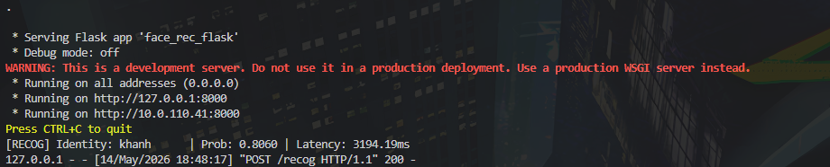
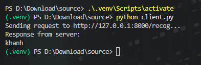

# 🚀 Hệ Thống Nhận Diện Khuôn Mặt Phân Tán (IoT Edge Platform)

Dự án này là một hệ thống AI nhận diện khuôn mặt theo mô hình **Client-Server**. Hệ thống được thiết kế để triển khai trên các thiết bị IoT (như Raspberry Pi) hoặc máy tính cá nhân.

- **Client**: (Raspberry Pi/Laptop) Thu thập hình ảnh từ webcam và gửi yêu cầu nhận diện.
- **Edge Server**: (PC/Cloud) Nhận hình ảnh, trích xuất đặc trưng bằng **FaceNet** và phân loại danh tính.

---

## 📂 1. Cấu Trúc Dự Án (Project Structure)

```text
.
├── Dataset/             # Dữ liệu hình ảnh
│   ├── raw/             # Ảnh gốc thu thập (chia theo thư mục tên người)
│   └── processed/       # Ảnh đã qua xử lý (căn chỉnh 160x160)
├── Models/              # Chứa các file mô hình (.pb, .pkl)
├── src/                 # Mã nguồn xử lý AI & Server
│   ├── align/           # Thư viện căn chỉnh khuôn mặt MTCNN
│   ├── templates/       # Giao diện Web (dành cho chế độ Mobile)
│   ├── classifier.py    # Huấn luyện mô hình nhận diện (SVM)
│   └── face_rec_flask.py # Flask Server xử lý Request nhận diện
├── webcam_client.py     # Script chạy webcam real-time (Client)
├── client.py            # Script test nhận diện 1 file ảnh
└── requirements.txt     # Danh sách thư viện cần cài đặt
```

---

## 🛠 2. Hướng Dẫn Cài Đặt (Cho người mới bắt đầu)

### Bước 1: Cài đặt Python
Đảm bảo bạn đã cài đặt **Python 3.12** (Phiên bản khuyến nghị cho dự án này).

### Bước 2: Tải Mô Hình (Pre-trained Models)
Do kích thước file mô hình rất lớn, chúng không được lưu trên GitHub. Bạn cần tải về và giải nén vào thư mục `Models/`.
> [🔗 Link tải Models](https://drive.google.com/drive/folders/1pGjoz7Glhb6JbjHpktzfSfmz-IIxIOms)

### Bước 3: Tạo Môi Trường Ảo & Cài Thư Viện
Mở Terminal/PowerShell tại thư mục dự án và chạy các lệnh sau:

```powershell
# 1. Tạo môi trường ảo (venv) với Python 3.12
# Windows (Sử dụng 'py' để chọn đúng phiên bản nếu máy cài nhiều bản Python)
py -3.12 -m venv .venv

# Linux/macOS
python3.12 -m venv .venv

# 2. Kích hoạt môi trường
# Windows:
.\.venv\Scripts\activate
# Linux/macOS:
source .venv/bin/activate

# 3. Cài đặt các thư viện cần thiết
pip install -r requirements.txt
```

---

## 📸 3. Quy Trình Huấn Luyện (Training Workflow)

Nếu bạn muốn thêm người mới vào hệ thống, hãy làm theo 3 bước sau:

1.  **Thu thập ảnh**: Tạo thư mục tên người đó trong `Dataset/raw/TEN_NGUOI` và để ít nhất 20 ảnh khuôn mặt của họ vào đó.
2.  **Căn chỉnh ảnh (Align)**: Chạy lệnh sau để cắt và chuẩn hóa khuôn mặt:
    ```powershell
    python src/align_dataset_mtcnn.py Dataset/raw Dataset/processed --image_size 160 --margin 32 --random_order
    ```
3.  **Huấn luyện (Train)**: Cập nhật "bộ não" cho AI:
    ```powershell
    python src/classifier.py TRAIN Dataset/processed Models/20180402-114759.pb Models/facemodel.pkl
    ```

---

## 🚀 4. Cách Chạy Ứng Dụng

Hệ thống hoạt động theo cặp Server và Client. Bạn cần chạy Server trước.

### Phần A: Chạy trên cùng một máy tính (Local)

1.  **Khởi động Server**:
    ```powershell
    python src/face_rec_flask.py
    ```
    *(Server sẽ chạy tại cổng 8000)*

2.  **Chạy Client (Webcam)**: Mở một Terminal mới (vẫn kích hoạt .venv) và chạy:
    ```powershell
    python webcam_client.py
    ```

### Phần B: Chạy qua Điện Thoại (Mobile)

1.  Sử dụng các công cụ như **Ngrok** hoặc **Pinggy** để public cổng `8000`.
2.  Truy cập vào đường dẫn HTTPS được cung cấp trên trình duyệt điện thoại.
3.  Cho phép trình duyệt truy cập Camera để bắt đầu nhận diện.

### Minh họa kết quả chạy (Log Results)

| Log Server (Nhận Request) | Log Client (Gửi Ảnh) |
| :--- | :--- |
|  |  |

---

## ❓ Xử Lý Sự Cố (Troubleshooting)

-   **Lỗi "File Not Found" ở Models/**: Hãy chắc chắn bạn đã tải file `.pb` và `.pkl` vào đúng thư mục `Models/`.
-   **Lỗi Camera trên trình duyệt**: Chrome/Safari yêu cầu kết nối **HTTPS** để mở Camera. Sử dụng Ngrok nếu bạn chạy từ xa.
-   **Nhận diện sai tên**: Hãy kiểm tra lại bước 2 & 3 của quy trình huấn luyện, đảm bảo ảnh trong `Dataset/raw` rõ nét và đủ số lượng.

---
*Dự án thực hiện cho môn học NT532 - IoT Platform.*
